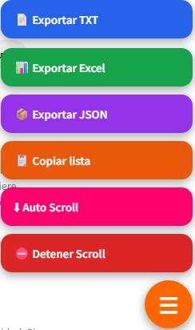

# Wattpad Novel List Extractor

**Última Actualización:** 14 de julio de 2026

Extrae automáticamente todas las novelas de cualquier lista de Wattpad, cargando el contenido completo mediante desplazamiento automático. Incluye un menú flotante moderno, vista previa integrada y exportación en múltiples formatos.

## 📖 Descripción

**Wattpad Novel List Extractor** es un UserScript para **Tampermonkey** que facilita obtener el listado completo de novelas de cualquier lista de Wattpad.

El script detecta automáticamente todas las novelas, incluso aquellas que normalmente solo aparecen al hacer scroll. Además permite visualizar la lista antes de exportarla y guardar la información en distintos formatos.

Todo se controla desde un panel flotante moderno integrado directamente en la página.

---

# 📥 Instalación

1. Instala la extensión **Tampermonkey** en tu navegador.

2. Instala el script desde GitHub:

**➡️ [Instalar Script](https://github.com/wernser412/Wattpad-Novel-List-Extractor/raw/refs/heads/main/Wattpad%20Novel%20List%20Extractor.user.js)**

---

# ✨ Características

- 📚 Extrae automáticamente todas las novelas de una lista.
- 🔄 Scroll automático hasta cargar toda la lista.
- 👁️ Vista previa integrada de las novelas detectadas.
- 🔍 Buscador para filtrar novelas por título.
- 📄 Exportación a TXT.
- 📊 Exportación a Excel (.xlsx).
- 📦 Exportación a JSON.
- 📋 Copiar toda la lista al portapapeles.
- 🚀 Menú flotante moderno.
- 🔔 Mensajes visuales durante el proceso.
- 📈 Contador de novelas detectadas.
- 🔗 Acceso directo a cada novela desde la vista previa.
- ⚡ Compatible con la navegación dinámica (SPA) de Wattpad.
- 💾 Permite mostrar u ocultar el botón flotante desde el menú de Tampermonkey.
- ⌨️ Cierre rápido del panel con la tecla **Esc**.

---

# 🖥️ Uso

1. Abre una lista de Wattpad.
2. Pulsa el botón flotante ☰.
3. Elige la acción que deseas realizar.
4. El script cargará automáticamente todas las novelas de la lista.
5. Exporta la información o visualízala desde el panel.

---

# 📄 Información exportada

Cada novela incluye:

- 📖 Título.
- 🔗 Enlace directo.
- 📑 Número de partes (cuando está disponible).

---

# 📤 Formatos disponibles

El script puede exportar la información en:

- 📄 TXT
- 📊 Excel (.xlsx)
- 📦 JSON
- 📋 Copiar directamente al portapapeles

---

# 👁️ Vista previa

El visor integrado permite:

- Buscar novelas por nombre.
- Abrir cualquier novela con un clic.
- Ver la cantidad total de novelas detectadas.
- Navegar cómodamente por listas muy grandes.

---

# 📄 Sitio compatible

Actualmente el script funciona en:

- Wattpad

---

# 📄 Licencia

Este proyecto se distribuye bajo la licencia **MIT**.

Consulta el archivo **LICENSE** para más información.
